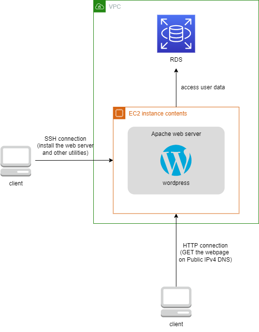

# AWS System Architectures

## Install a webserver on EC2 and host Wordpress + access RDS

[reference](https://docs.aws.amazon.com/AmazonRDS/latest/UserGuide/CHAP_Tutorials.WebServerDB.CreateWebServer.html)
